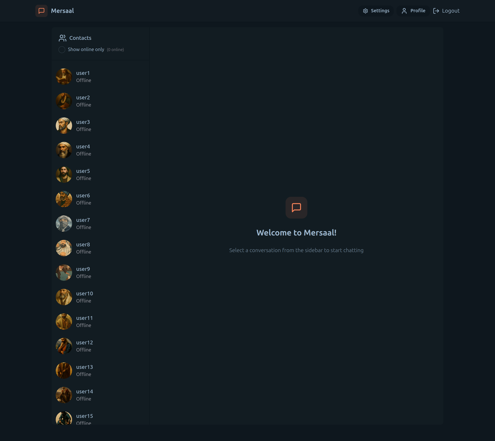
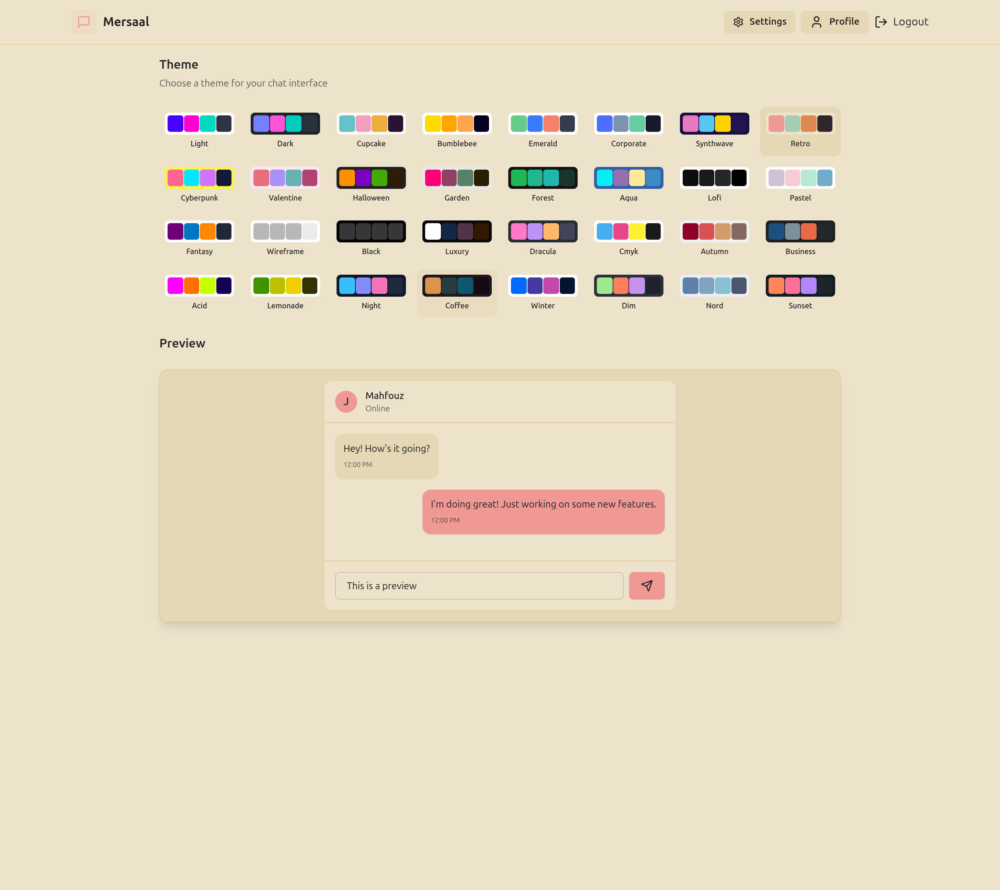

# 💬 Mersaal - Real-Time Chat Application

**Mersaal** is a real-time chat application built with the MERN stack and **Socket.IO**. It allows users to communicate instantly, personalize the chat experience with over 30 unique color themes, and update their profile pictures using **Cloudinary**.





---

## 🌟 Features

- ⚡ Real-time messaging using **Socket.IO**
- 🎨 30+ vibrant themes to customize the interface
- 🖼️ Upload profile pictures directly via **Cloudinary**
- 🔐 Secure authentication with **bcrypt** password hashing
- 📃 Contact list with online/offline user status
- 🧑 Profile settings: change avatar and theme
- 🌐 Responsive and modern UI using **TailwindCSS**
- 📁 Backend API built with **Node.js** and **Express**
- 🗃️ MongoDB database for user and message storage

---

## 🧰 Tech Stack

### 🔹 Frontend

- React
- TailwindCSS
- Axios
- Socket.IO Client

### 🔸 Backend

- Node.js
- Express.js
- MongoDB with Mongoose
- bcrypt
- Cloudinary SDK
- Socket.IO

---

## 🖼️ Screenshots

| Main Interface   | Theme Picker       | Retro Theme Chat  |
| ---------------- | ------------------ | ----------------- |
|  |  |  |

---

## 🚀 Getting Started

### Prerequisites

- Node.js (v16 or higher)
- MongoDB (local or Atlas)
- A Cloudinary account

### 1. Clone the Repository

````bash
git clone https://github.com/your-username/mersaal.git
cd mersaal

### Setup .env file

```js
MONGODB_URI=...
PORT=5001
JWT_SECRET=...

CLOUDINARY_CLOUD_NAME=...
CLOUDINARY_API_KEY=...
CLOUDINARY_API_SECRET=...

NODE_ENV=development
````

### Build the app

```shell
npm run build
```

### Start the app

```shell
npm start
```

# Chat-App
